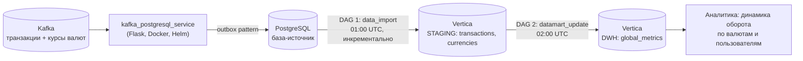

# FinTech Data Platform: ETL, DWH (Vertica)


## Описание проекта

В рамках проекта реализована полноценная аналитическая платформа для финтех-стартапа, предоставляющего международные банковские переводы.  

Цель решения — объединить транзакционные данные из различных источников, загрузить их в хранилище данных (Vertica), построить витрину с агрегированной финансовой аналитикой для бизнеса.

Проект охватывает полный цикл работы с данными:
- загрузку из источников,
- построение staging-слоя,
- инкрементальное обновление DWH,
- формирование витрины.

---

## Архитектура решения

### Источники данных
- Kafka / PostgreSQL
- Данные:
  - `transactions` — транзакционная активность пользователей
  - `currencies` — курсы валют

### Слои хранилища (Vertica)

- `*_STAGING` — слой сырых данных
- `*_DWH` — слой витрин
- `global_metrics` — агрегированная витрина для аналитики

### Оркестрация
- Apache Airflow (DAG-и):
  - `1_data_import_dag.py` — загрузка данных в staging
  - `2_datamart_update_dag.py` — обновление витрины

### Дополнительные сервисы
- Kafka → PostgreSQL сервис (outbox pattern)
- Docker-инфраструктура
- Helm-конфигурация для деплоя сервиса


---
## Структура проекта

```text
.
├── src/
│   ├── dags/                            # DAG-и Airflow
│   │   ├── 1_data_import_dag.py         #   PostgreSQL → Vertica STAGING (01:00 UTC)
│   │   └── 2_datamart_update_dag.py     #   STAGING → DWH.global_metrics (02:00 UTC)
│   ├── py/                              # ETL-логика
│   │   ├── postgresql_vertica_import.py #   загрузка transactions/currencies в staging
│   │   ├── vertica_datamart_update.py   #   инкрементальное обновление витрины
│   │   ├── etl_settings_repository.py   #   workflow-настройки (инкрементальность)
│   │   └── lib/                         #   коннекторы к PostgreSQL и Vertica
│   ├── sql/                             # DDL/DML: staging, DWH, outbox, merge
│   └── img/
├── service_kafka_postgresql/            # сервис Kafka → PostgreSQL (outbox pattern)
│   ├── src/                             #   Flask-приложение и процессор сообщений
│   ├── app/                             #   Helm-чарт для деплоя в Kubernetes
│   ├── dockerfile
│   └── requirements.txt
├── docker-compose.yaml                  # запуск сервиса
└── README.md
```
---

## Реализованный пайплайн

### 1️⃣ Загрузка данных в STAGING

- Ежедневная инкрементальная загрузка данных
- Поддержка параметра даты
- Автоматический запуск за выбранный период (октябрь 2022)
- Хранение данных в Vertica с проекциями, сегментацией и сортировкой

---

### 2️⃣ Обновление витрины `global_metrics`

Инкрементальное обновление витрины по дням (за вчера).

Дополнительно реализовано:
- Очистка тестовых аккаунтов (`account_number < 0`)
- Конвертация оборота в единую валюту
- Расчёт бизнес-метрик

---
## Как запустить

### 1. Подготовить базы

Выполнить SQL-скрипты из `src/sql/` в соответствующих базах (PostgreSQL — источник и outbox,
Vertica — схемы `STAGING` и `DWH`, таблица workflow-настроек).

### 2. Запустить сервис Kafka → PostgreSQL

Сервис читает сообщения из Kafka и пишет их в PostgreSQL (outbox pattern).
Все параметры передаются через переменные окружения (см. `docker-compose.yaml`):

```bash
# создать .env рядом с docker-compose.yaml
cat > .env <<EOF
KAFKA_HOST=<хост>
KAFKA_PORT=<порт>
KAFKA_CONSUMER_USERNAME=<логин>
KAFKA_CONSUMER_PASSWORD=<пароль>
KAFKA_CONSUMER_GROUP=<группа>
KAFKA_SOURCE_TOPIC=<топик>
PG_WAREHOUSE_HOST=<хост>
PG_WAREHOUSE_PORT=<порт>
PG_WAREHOUSE_DBNAME=<база>
PG_WAREHOUSE_USER=<логин>
PG_WAREHOUSE_PASSWORD=<пароль>
EOF

docker-compose up -d
```

### 3. Деплой DAG-ов в Airflow

1. Скопировать `src/dags/` и `src/py/` в каталог DAG-ов Airflow (`AIRFLOW_HOME/dags/`).
2. Создать подключения: `PG_WAREHOUSE_CONNECTION` (PostgreSQL) и
   `VERTICA_WAREHOUSE_CONNECTION` (Vertica) — Admin → Connections.
3. Включить DAG-и в UI: `final_project_postgresql_to_vertica_data_transfer_dag`
   и `final_project_vertica_datamart_updater_dag`.
---

## Технологии

- Python
- Apache Airflow
- Apache Kafka
- PostgreSQL
- Vertica (DWH)
- Docker
- Helm

---

## Результат

В результате создана масштабируемая аналитическая платформа, которая:

- агрегирует финансовые данные из распределённых источников;
- обеспечивает ежедневное инкрементальное обновление витрины;
- предоставляет бизнесу прозрачную картину динамики оборота;
- позволяет анализировать транзакционную активность по валютам и пользователям.

Проект демонстрирует навыки построения DWH, проектирования ETL-пайплайнов, работы с потоковыми и batch-данными на промышленном стеке.

---
## Лицензия

Проект распространяется по лицензии [MIT](LICENSE.txt).
